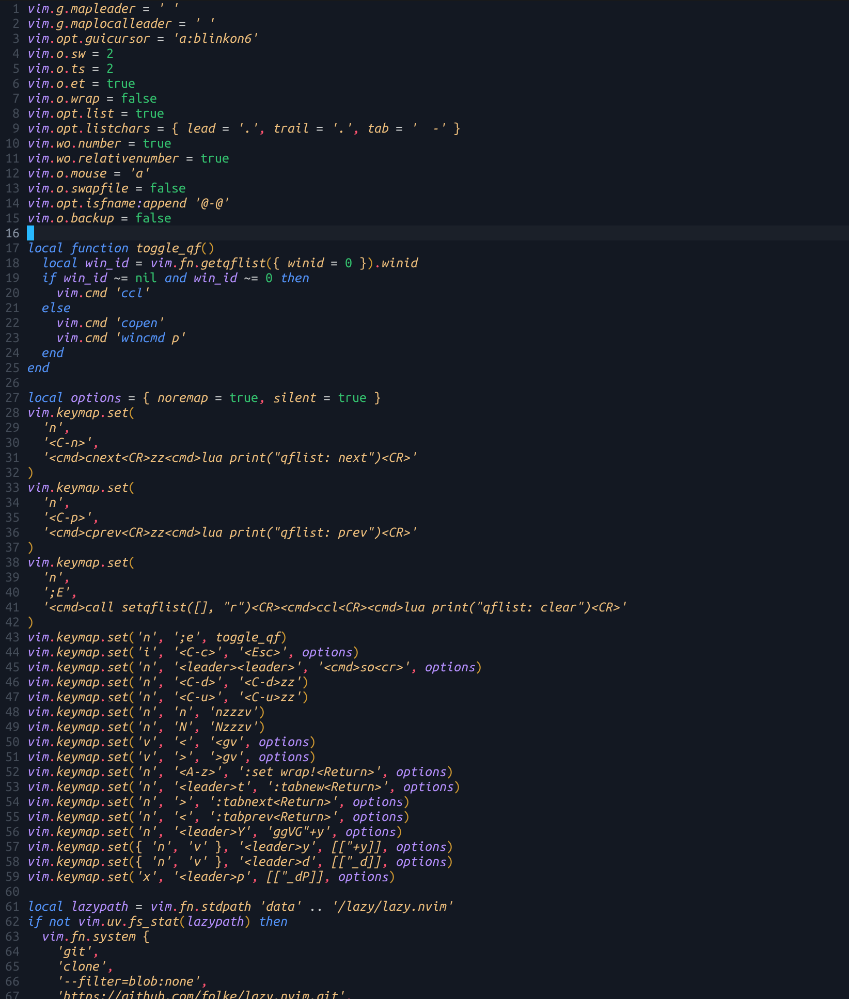

# SpaceBox Theme for Neovim

A sleek and professional dark theme for Neovim, ported from the popular [SpaceBox VS Code theme](https://github.com/amnweb/SpaceBox-Theme).

## Installation

### Using Lazy.nvim

```lua
{
    'maroozm/spacebox-nvim',
    lazy = false,
    priority = 1000,
    config = function()
        require('spacebox').setup({
            -- your configuration
        })
        require('spacebox').colorscheme()
    end,
}
```

### Using Packer.nvim

```lua
use {
    'maroozm/spacebox-nvim',
    config = function()
        require('spacebox').setup({})
        require('spacebox').colorscheme()
    end,
}
```

### Setting the Colorscheme

After setup, activate the colorscheme:

```lua
require('spacebox').colorscheme()
```

Or use the traditional Neovim command:

```vim
:colorscheme spacebox
```

### Plugin Integrations

#### Bufferline.nvim

```lua
require('bufferline').setup({
    highlights = require('spacebox').bufferline.highlights,
})
```

## Credits

This Neovim theme is a port of the [SpaceBox Theme for VS Code](https://github.com/amnweb/SpaceBox-Theme) created by [@amnweb](https://github.com/amnweb). All credit for the original color scheme and design goes to the original authors.

This Neovim port was built using the [nvim-colorscheme-template](https://github.com/datsfilipe/nvim-colorscheme-template) by [@datsfilipe](https://github.com/datsfilipe), which provided the excellent foundation and structure for creating Neovim colorschemes.

- Original VS Code Theme: [SpaceBox-Theme](https://github.com/amnweb/SpaceBox-Theme)
- VS Code Marketplace: [SpaceBox Theme](https://marketplace.visualstudio.com/items?itemName=SpaceBox.spacebox-theme)
- Neovim Template: [nvim-colorscheme-template](https://github.com/datsfilipe/nvim-colorscheme-template)

## Contributing

Contributions are welcome! Please open an issue if you encounter any bugs or have suggestions for improvements. Pull requests are also appreciated.

## License

[MIT License](LICENSE) 

<br/>

 

<br/>

</div>